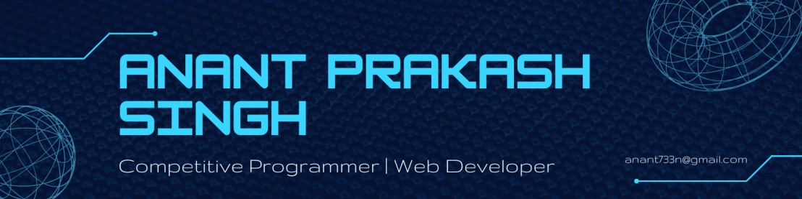

<!-- #  Hi there 👋, I am [Anant Prakash Singh!](https://linkedin.com/in/anant-prakash-singh-625b21224) -->

<!-- ; -->

<h1> 𝐇𝐢 𝐭𝐡𝐞𝐫𝐞, 𝐟𝐞𝐥𝐥𝐨𝐰 <𝚍𝚎𝚟𝚎𝚕𝚘𝚙𝚎𝚛𝚜/>! </h1>

A bit about myself, I am <a href="https://anant-prakash-singh.vercel.app/">Anant Prakash Singh</a> 👦 pursuing my <b>Computer Science Degree</b>💻 currently in pre-final year from <b>Indian Institute of Technology Ropar🏫</b>. I am a caffeine-fueled alchemist who turns coffee☕ into code and ideas into reality. As of now, I am focused on <b>Competitive Programming, Web Development and Backend Engineering</b> but still wish to explore many fields.⚡

<h3 align="center">Competitive&nbsp;Programmer | Passionate&nbsp;Web&nbsp;Developer</h3>

 

  

 

# 🌐 Connect with me:

 &nbsp;
 &nbsp;
 &nbsp;
 &nbsp;
 &nbsp;
 &nbsp;
 &nbsp;
 &nbsp;

Looking forward to collaborate on some amazing projects. Let's get in touch and form long lasting bonds.🤝

 

<!-- ## 🌐 Socials:
  -->

<!-- # 💻 Tech Stack: -->
# 🧰 My Toolkit
                             

I believe in implementing the knowledge which you have. Projects play a major role in showcasing your skills. They help in predicting skills of a person. So let's have a look at my project section.

  
  

<!-- <h1 align="center">Projects</h1>

Logo  | Project Name | Description | 
:---: | :---:        |    :----    |
 | [Project Name](https://project-link.com) | Project description Project description Project description Project description Project description Project description Project description Project description Project description Project description Project description | -->

 

# 🏆 My Github Stats:

<!-- Streak -->

<!-- Trophies -->

  

<table align="center">
  <tr>
  <td align="center">
    
  </td>
  <td align="center">
    
  </td>
</table>

 The above stats don't necessarily reflect my actual skill level or proficiency. They just show which languages I tend to use the most. And to be honest, some of them aren't even listed up there. P.S: Please don't ask me if I'm a master C developer or HTML programmer. Let's chat more about my actual experience and skills, rather than relying solely on those numbers. Thanks!

  

<!-- <table>
  <tr>
   <td>
    <td></td>
  </tr>
</table> -->

---
<!--  -->

<!--  -->
<!--   -->
<!--   -->
<!--  -->

<!-- ### ✍️ Random Dev Quote -->
<!--  -->

<!-- ### 😂 Random Dev Meme
 -->

<!-- 
 -->

  <!-- 

 -->

  <!--  -->

  <!--  -->

<!-- 
 -->
